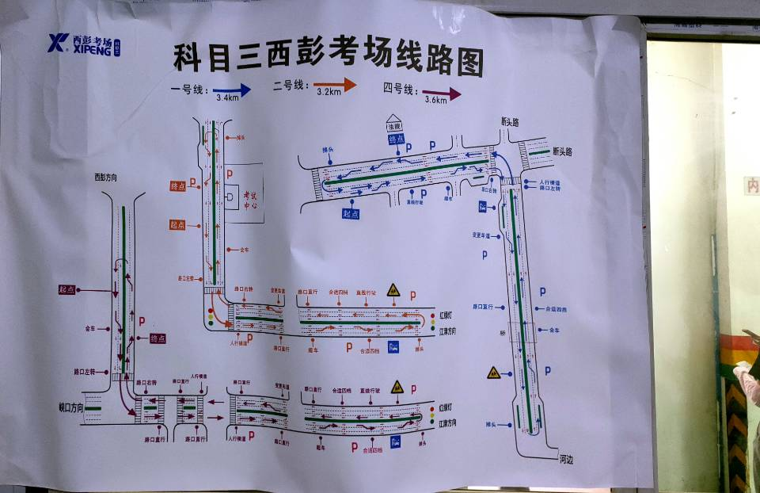

# 考驾照细节注意
## 项目流程
1. 考前准备
   1. 上车调整好方向和座椅,检查灯光,档位,手刹.举手请求考试,下车巡视一圈,按按钮,回位置后系好安全带.
   2. 完成灯光考试 
2. 起步
   1. 打灯,挂挡,观察左边路况,保证左后方没有车辆
   2. 松离合至半联动,观察左边路况安全后,放下手刹并且往下压一下,保持半联动至少三秒
   3. 进入主路后,踩油门换二档,平稳起步
3. 直线行驶
   1. 左右观察,微调方向至直线
   2. 踩油门加速到25左右,坐直看远,稳住方向盘不动
4. 超车
   1. 打左转向灯,左右观察,数5秒
   2. 保证安全情况下,向左变道
   3. 变道完成后,加速,打起右转弯灯
   4. 速度到25以上,数八秒后,观察右方安全,向右变道
   5. 变道后,超车完成
5. 右转
   1. 打右转向灯,左右观察,踩刹车
   2. 在路口安全的情况下进入路口,不安全马上踩停
   3. 右转转小弯,进入第二车道,频繁左右观察踩刹车
   4. 前方是公交站台,左右观察踩刹车
6. 自主变道
   1. 打左转弯灯,左右观察
   2. 数五秒后向左转弯
7. 路口直行: 左右观察踩刹车
8. 会车:左右观察踩刹车
9. 掉头:
   1. 打左转向灯,左右观察踩刹车
   2. 在转弯之前减速换为1挡,减速
   3. 也可以踩停
10. 加减档
    - 20以上加三挡
    - 三十以上加4挡
    - 数八下,然后减速到三十以内,换二档
11. 靠边停车
   - 打右转弯等,等待三秒
   - 向右变道,减速
   - 换一档,减速使用半离合
   - 头伸直,身子坐正,一旦对准点位就刹车
   - 空挡,手刹,解安全带,开关车门听成绩
## 考场路线图

